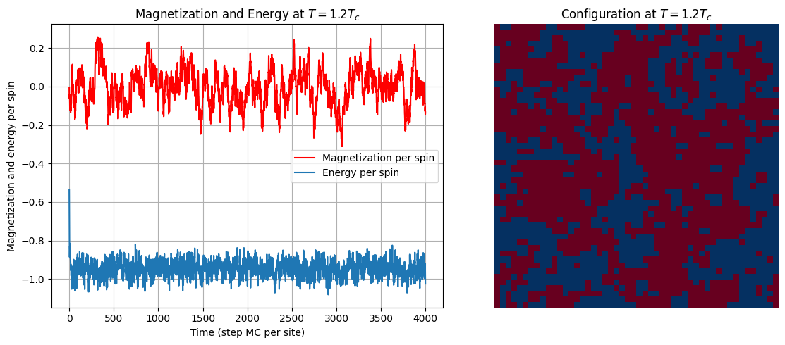
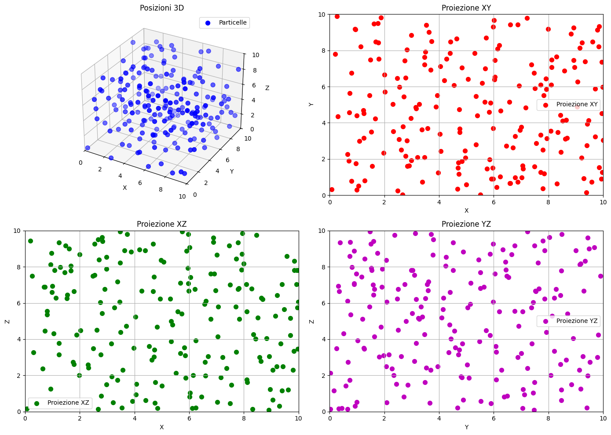

# Numerical Methods in Soft Matter 

This repository contains Python-based simulations developed for the **Numerical Methods in Soft Matter** course (University of Padua). The simulations implement Monte Carlo (MC) and Molecular Dynamics (MD) algorithms from scratch to study soft matter and statistical mechanics systems.

**report**: A comprehensive analysis of theoretical backgrounds and simulation results is available in [`docs/NMSM_SSalvatore.pdf`](./docs/NMSM_SSalvatore.pdf).

## Main topics

### Monte Carlo (MC) Methods
* Markov chains applied to the 2D Ising Model, with Metropolis algorithm.
* Implementation of Multiple Markov Chains, Multiple histogram method (reweighting technique)

### Molecular Dynamics (MD) Methods
* Integrators: Implementation of simplectic and non-simplectic algorithms, including Verlet and Velocity Verlet.
* Interactions: Pairwise, binding, and angular potentials for soft matter systems.
* Ensembles: Integration of thermostats for canonical ensemble ($NVT$) sampling.

---

##  Tech Stack and tools
* **Language**: Python
* **Core Libraries**: NumPy, SciPy, Matplotlib

